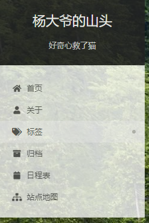
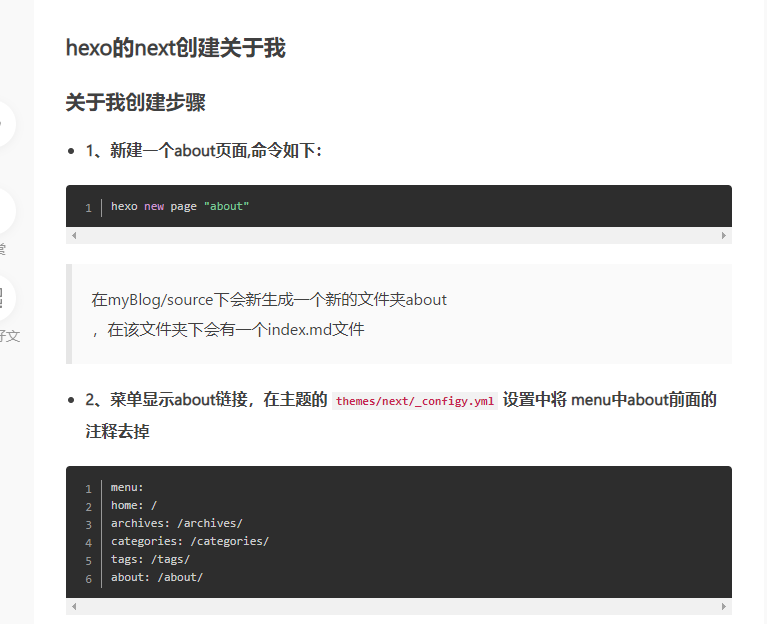

# hexo相关
<!--more-->
```
资源站记录
https://blog.csdn.net/qq_31880107/article/details/87283028
https://zhuanlan.zhihu.com/p/60424755

```

## 页面透明设置错误


```
git bash here
    hexo new <title>
    hexo new "我的第一篇文章"
    hexo clean          # 清除缓存文件等
    hexo g              # 生成页面
    hexo s              # 启动预览
    hexo d              # 部署
```
# <font color=red>现在已使用vscode hexo插件实现在vscode中编辑、发布博客啦</font>
# hexo 修改主题
[hexo文件夹布局解析](https://hexo.io/zh-cn/docs/themes.html#:~:text=%E4%B8%BB%E9%A2%98%20%E5%88%9B%E5%BB%BA%20Hexo%20%E4%B8%BB%E9%A2%98%E9%9D%9E%E5%B8%B8%E5%AE%B9%E6%98%93%EF%BC%8C%E6%82%A8%E5%8F%AA%E8%A6%81%E5%9C%A8%20themes,%E6%96%87%E4%BB%B6%E5%A4%B9%E5%86%85%EF%BC%8C%E6%96%B0%E5%A2%9E%E4%B8%80%E4%B8%AA%E4%BB%BB%E6%84%8F%E5%90%8D%E7%A7%B0%E7%9A%84%E6%96%87%E4%BB%B6%E5%A4%B9%EF%BC%8C%E5%B9%B6%E4%BF%AE%E6%94%B9%20_config.yml%20%E5%86%85%E7%9A%84%20theme%20%E8%AE%BE%E5%AE%9A%EF%BC%8C%E5%8D%B3%E5%8F%AF%E5%88%87%E6%8D%A2%E4%B8%BB%E9%A2%98%E3%80%82)
# next主题修改为可更新网络图片

# 添加各种导航页


```
1.配置分类
1.1 在主题里配置好分类
首先我们得先在主题里把分类这个选项打开，例如在 Next 主题下找到hexo 博客项目文件夹下 \themes\next_config.yml 这个路径得配置文件,然后打开这个文件并找到下面得代码
menu:
  home: / || fa fa-home
  # about: /about/ || fa fa-user
  tags: /tags/ || fa fa-tags
  categories: /categories/ || fa fa-th
  archives: /archives/ || fa fa-archive
  # schedule: /schedule/ || fa fa-calendar
  # sitemap: /sitemap.xml || fa fa-sitemap
  # commonweal: /404/ || fa fa-heartbeat

复制代码
然后放开  categories: /categories/ || fa fa-th  这行代码就已经配置好里分类。
1.2 创建分类目录文件

因为分类页是没有默认页面的所以需要我们手动创建分类页。

打开命令行，进入博客项目所在的文件夹下，执行以下命令
$ hexo new page categories
复制代码
成功后会提示：
INFO  Created: ~/blog/source/categories/index.md
复制代码
这样我们就创建好了分类页面了。但是这个时候主题还不会识别这个页面为分类页；所以我们需要编辑这个新建的页面，让主题识别这个页面，并自动为这个页面显示分类。
1.3 编辑页面让主题识别页面为分类页面
上文说到需要编辑页面才能让主题识别这个页面为分类页面，我们只需要根据成功后到提示路径打开index.md这个页面文件，打开后默认内容是
---
title: 文章分类
date: 2021-01-25 22:37:25
---
复制代码
我们需要添加上type: "categories"这段代码就能让主题识别该页面为分类页面了
---
title: 文章分类
date: 2021-01-25 22:37:25
type: "categories"
---
复制代码
我们就完成了整个分类页面的配置了
1.4 给文章设置分类属性
首先打开需要添加分类的文章，在文章里添加上以下文案就设置好分类了
---
categories: 
- Android
---
复制代码
如上categories:Android表示添加这边文章到 “Android” 这个分类下。
然后我们就可以在博客到分类里看到该分类了。
//设置二级分类
---
categories: 
- Android
- xxx
---
复制代码
如上设置二级分类则该篇文章为 Android 分类下的 XXX 分类下。
2.配置标签
2.1 在主题里配置好标签
首先我们得先在主题里把分类这个选项打开，例如在 Next 主题下找到hexo 博客项目文件夹下 \themes\next_config.yml 这个路径得配置文件,然后打开这个文件并找到下面得代码
menu:
  home: / || fa fa-home
  # about: /about/ || fa fa-user
  tags: /tags/ || fa fa-tags
  categories: /categories/ || fa fa-th
  archives: /archives/ || fa fa-archive
  # schedule: /schedule/ || fa fa-calendar
  # sitemap: /sitemap.xml || fa fa-sitemap
  # commonweal: /404/ || fa fa-heartbeat

复制代码
然后放开  tags: /tags/ || fa fa-tags 这行代码就已经配置好里分类。
2.2 创建标签目录文件

和分类页一样，标签页也是没有默认页面的所以需要我们手动创建标签页。

打开命令行，进入博客项目所在的文件夹下，执行以下命令
$ hexo new page tags
复制代码
成功后会提示：
INFO  Created: ~/blog/source/tags/index.md
复制代码
这样我们就创建好了标签页面了。但是这个时候主题还不会识别这个页面为标签页；所以我们需要编辑这个新建的页面，让主题识别这个页面，并自动为这个页面显示标签。
2.3 编辑页面让主题识别页面为标签页面
上文说到需要编辑页面才能让主题识别这个页面为标签页面，我们只需要根据成功后到提示路径打开index.md这个页面文件，打开后默认内容是
---
title: 标签
date: 2021-01-25 22:54:58
---
复制代码
我们需要添加上type: "tags"这段代码就能让主题识别该页面为标签页面了
---
title: 标签
date: 2021-01-25 22:54:58
type: "tags"
---
复制代码
我们就完成了整个标签页面的配置了
2.4 给文章设置标签属性
首先打开需要添加标签的文章，在文章里添加上以下文案，就设置好标签里了
//设置单标签
---
tags:
- Facebook配置
---

//设置多标签 并同时设置分类
---
categories: 
- Android
tags:
- Android
- RecyclerView
---
复制代码
如上tags:- Facebook配置表示给这篇文章添加 “Facebook配置” 这个分标签。
然后我们就可以在博客到标签里看到该标签了。

作者：醉过才知酒浓
链接：https://juejin.cn/post/6921750181297782798
来源：稀土掘金
著作权归作者所有。商业转载请联系作者获得授权，非商业转载请注明出处。
```