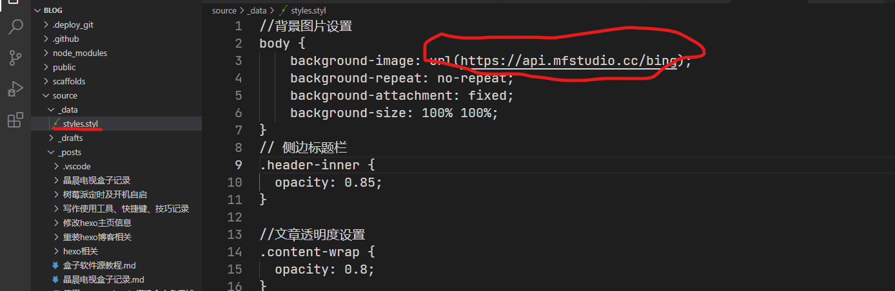

# hexo相关
<!--more-->
```
资源站记录
https://blog.csdn.net/qq_31880107/article/details/87283028
https://zhuanlan.zhihu.com/p/60424755

```

## 页面透明设置错误


```
git bash here
    hexo new <title>
    hexo new "我的第一篇文章"
    hexo clean          # 清除缓存文件等
    hexo g              # 生成页面
    hexo s              # 启动预览
    hexo d              # 部署
```
# <font color=red>现在已使用vscode hexo插件实现在vscode中编辑、发布博客啦</font>
# hexo 修改主题
[hexo文件夹布局解析](https://hexo.io/zh-cn/docs/themes.html#:~:text=%E4%B8%BB%E9%A2%98%20%E5%88%9B%E5%BB%BA%20Hexo%20%E4%B8%BB%E9%A2%98%E9%9D%9E%E5%B8%B8%E5%AE%B9%E6%98%93%EF%BC%8C%E6%82%A8%E5%8F%AA%E8%A6%81%E5%9C%A8%20themes,%E6%96%87%E4%BB%B6%E5%A4%B9%E5%86%85%EF%BC%8C%E6%96%B0%E5%A2%9E%E4%B8%80%E4%B8%AA%E4%BB%BB%E6%84%8F%E5%90%8D%E7%A7%B0%E7%9A%84%E6%96%87%E4%BB%B6%E5%A4%B9%EF%BC%8C%E5%B9%B6%E4%BF%AE%E6%94%B9%20_config.yml%20%E5%86%85%E7%9A%84%20theme%20%E8%AE%BE%E5%AE%9A%EF%BC%8C%E5%8D%B3%E5%8F%AF%E5%88%87%E6%8D%A2%E4%B8%BB%E9%A2%98%E3%80%82)
# next主题修改为可更新网络图片
