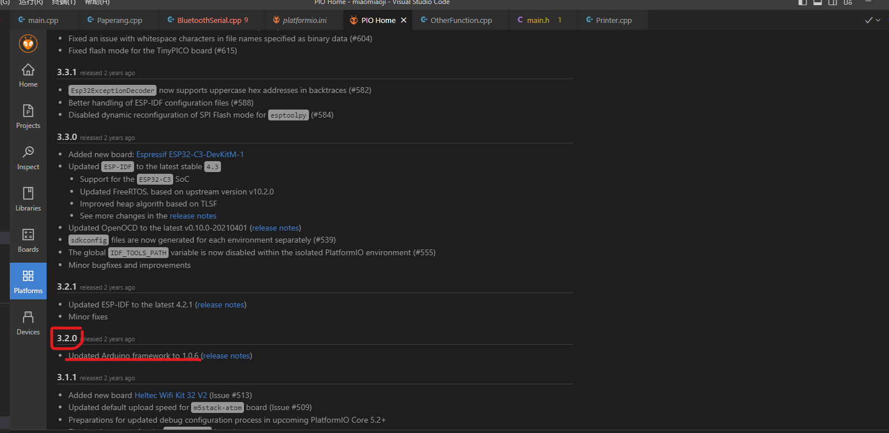
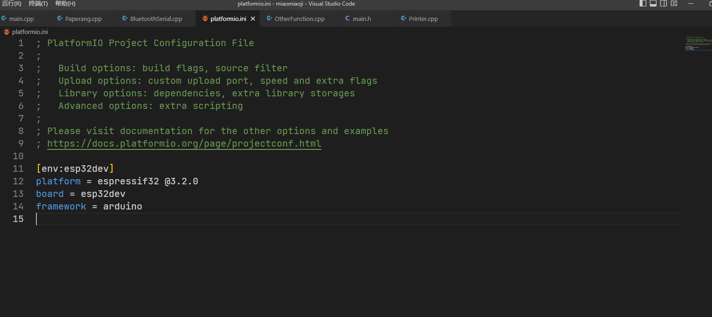

# platformio.ini文件配置举例<https://docs.platformio.org/en/latest/platforms/espressif32.html>
<!--more-->

```
[platformio]
default_envs = nodemcuv2

; Set/override default options for each "[env:***]"
[env]
build_flags =
    -D VERSION=1.2.3
    -D DEBUG=1
lib_deps_builtin =
    SPI
    Wire
lib_deps_external =
    bblanchon/ArduinoJson @ ~5.6,!=5.4
    https://github.com/gioblu/PJON.git#v2.0
    IRremoteESP8266=https://github.com/markszabo/IRremoteESP8266/archive/master.zip

[env:nodemcuv2]
platform = espressif8266
framework = arduino
board = nodemcuv2

; Build options
build_flags =
    ${env.build_flags}
    -DSSID_NAME=HELLO
    -DSSID_PASWORD=WORLD

; Library options
lib_deps =
    ${env.lib_deps_builtin}
    ${env.lib_deps_external}
    https://github.com/me-no-dev/ESPAsyncTCP.git
    knolleary/PubSubClient@^2.8
    paulstoffregen/OneWire

; Serial Monitor options
monitor_speed = 115200
monitor_flags =
    --encoding
    hexlify

; Unit Testing options
test_ignore = test_desktop

[env:bluepill_f103c8]
platform = ststm32
framework = arduino
board = bluepill_f103c8

; Library options
lib_deps = ${env.lib_deps_external}

; Debug options
debug_tool = custom
debug_server =
    ${platformio.packages_dir}/tool-jlink/JLinkGDBServer
    -singlerun
    -if
    SWD
    -select
    USB
    -port
    2331
    -device
    STM32F103C8

; Unit Testing options
test_ignore = test_desktop
```
from   
<https://docs.platformio.org/en/latest/projectconf/index.html>
```
upload_speed = 921600
monitor_speed = 115200
platform = espressif32 @1.8.0// **此处修改官方库为1.0.2（对应pio的1.8.0）**
```

***此处修改官方库为1.0.2（对应pio的1.8.0），图中为pio项目release可见1.0.1对应pio的1.6.0***
# 或者在vscode的pio插件platform中查看pio库对应安装的版本号，添加至platform.ini文件platform字段


# esp32 wrover添加spiram支持
