# noteexpress导入参考文献
<!--more-->
在文献网站下载引用的文献的noteexpress文件，导入题录快捷键Ctrl+M，选择剪切板或文件导入

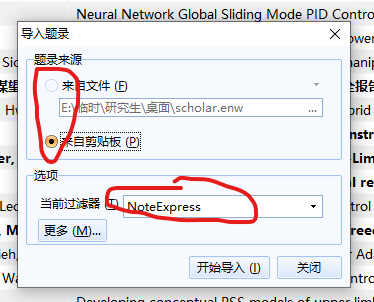

<font color=red>中文文献推荐在知网上导出，可以复制到剪切板，不用下载文件非常滴方便。</font>

知网导出文献：
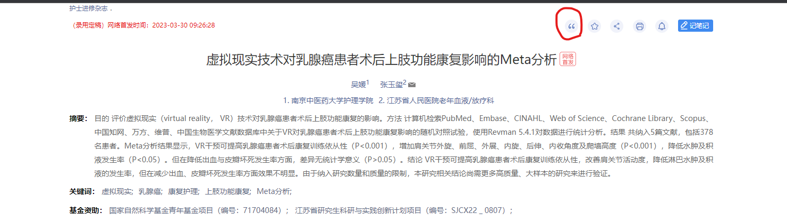
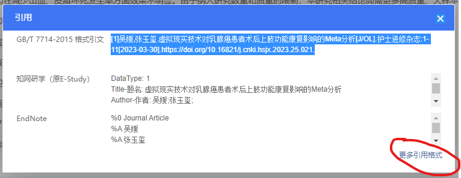
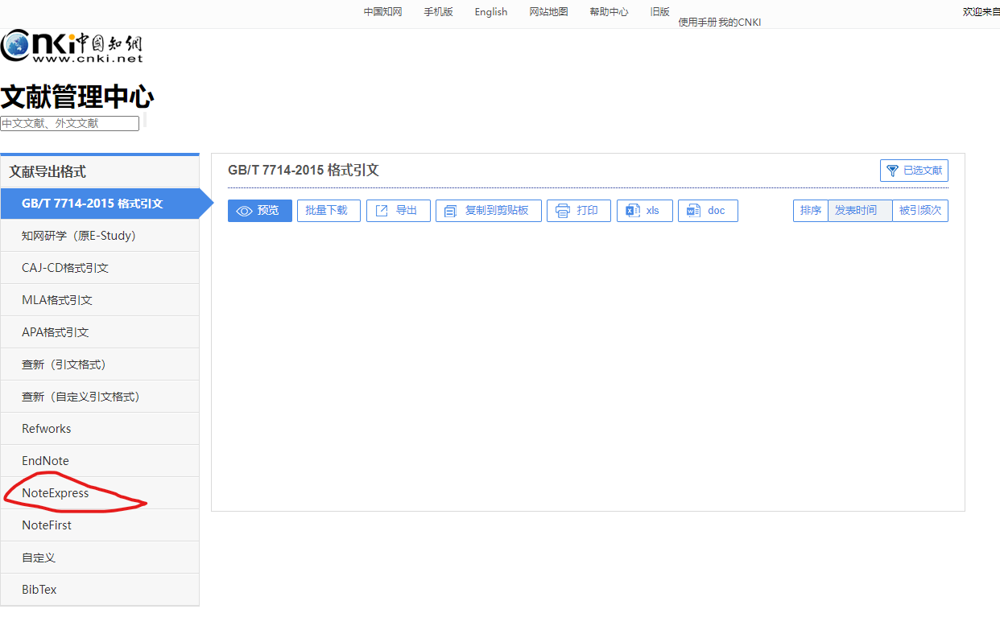
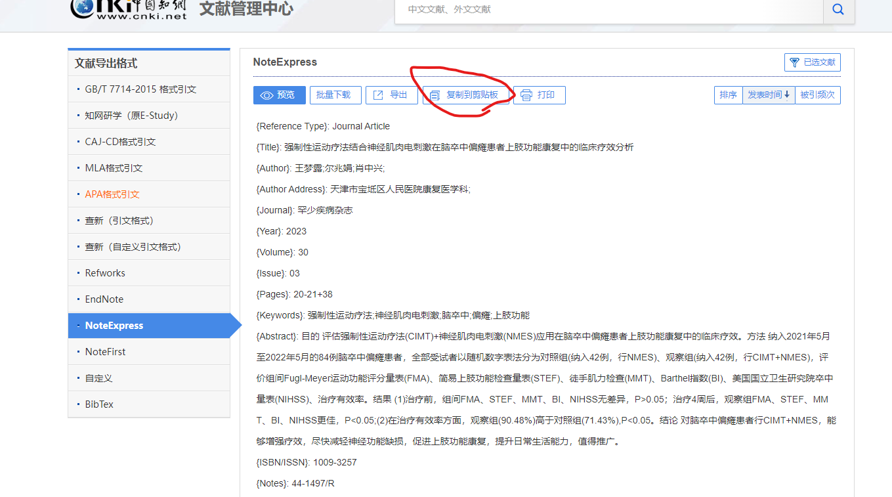
<font color=red>中文文献推荐在谷歌学术导出endnote格式的文献，部分文献的杂志名会全部大写，注意</font>

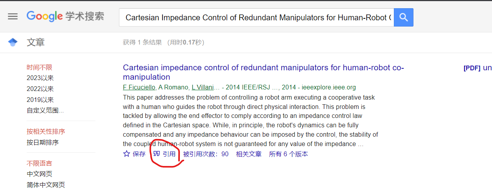
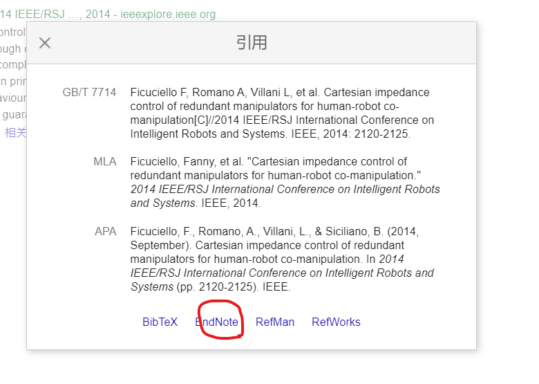
下载文件，在noteexpress中Ctrl+M->来自文件->当前过滤器选择endnote，导入即可。

# word插入参考文献
点击插入引文即可将noteexpress中选中的文献插入当前光标位置，点击格式化即可在文档末尾自动生成参考文献目录，在样式中选中更改的样式即可自动刷新应用，<font color=red>在相邻的文献序号间插入新文献，文献编号会自动后移，相当于文献的公式编辑器。</font>
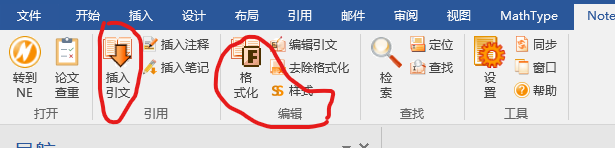
自动生成的参考文献目录，在中英文交接处会出现对不齐的问题，可将序号后的空格替换为制表符，即可实现自动调整对齐。

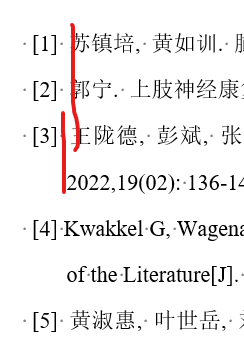
```
NoteExpress插入word的参考文献会出现无法对齐的问题，需要取消所有空格，插入制表符（Tab）
Ctrl+H打开替换窗口，“替换内容”框输入：
(\[[0-9]{1,}\])
替换为框 输入：
\1^t
勾选“使用通配符”。全部替换。不放心可以一个一个点击替换。
```
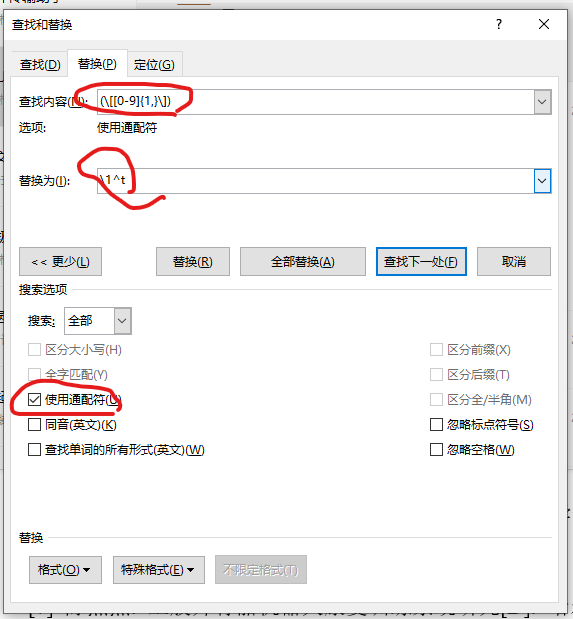
# 修改参考文献的输出样式
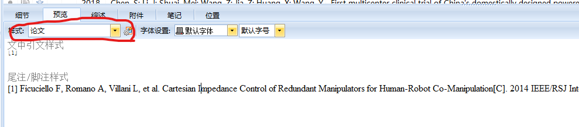
主要修改的是题录->模板中的内容

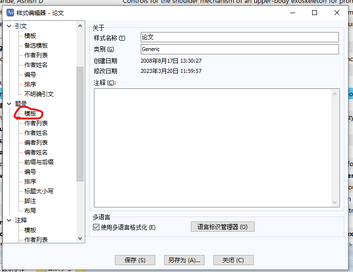
可分别设置中英文、各种文献的格式（方便后期某一类文献需要添加页数、日期等字段都可在此处修改样式后，一键添加）
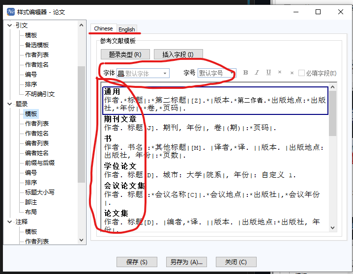
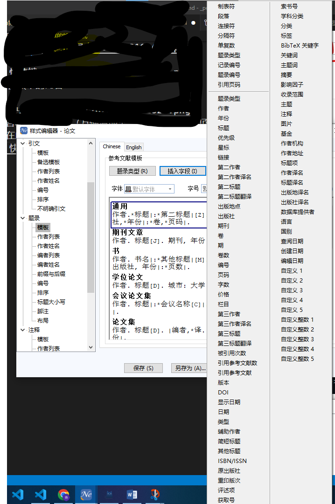

插入字段简记
```
（1）连接符 * 主要作用是“建立依赖关系”，当在两个字段之间插入“连接符”时，插入连接符前后的两个字段将建立相互依赖的关系；另处一个作用是代替空格，如果在一地方是要固定地输出空格的话，就可以用连接符（*）代替空格，例如 *版本*ed.*城市中，版本和它前面的字段要有一个固定的空格，那么我们就可以用连接符（*）代替（ ）来实现，同样的道理，城市和前面的“*ed.”也存在一固定空格，仍可以用连接符（*）实现。

（2）分隔符 | 作用是“破坏依赖关系”。如：“卷|(期)|”中，如果卷和期中间不加入分隔符的话，根据“向前依赖关系”，“（”就要和“卷”相依赖，那么如果卷如果不存在的话，“期”前面的“（”也将不输出，这样将少输出一个“（”，另外如果“卷”存在而“期”不存在时，此时“期”后面的“）”将不输出的，但是它前面的“（”将会输出，这也将出现输出错误。所以要用分隔符“|”将“期”前后的“（”、“）”连同“期”一起和别的 分隔开，使“（”、“期”、“）”三者之间建立一个独立的依赖关系。
```
其他可参考链接<https://zhuanlan.zhihu.com/p/417540537>