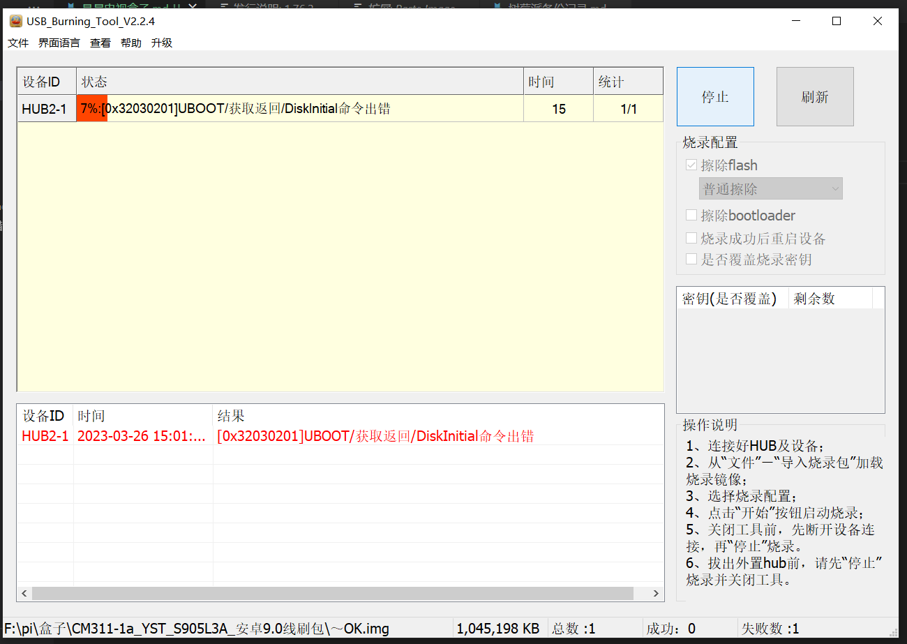
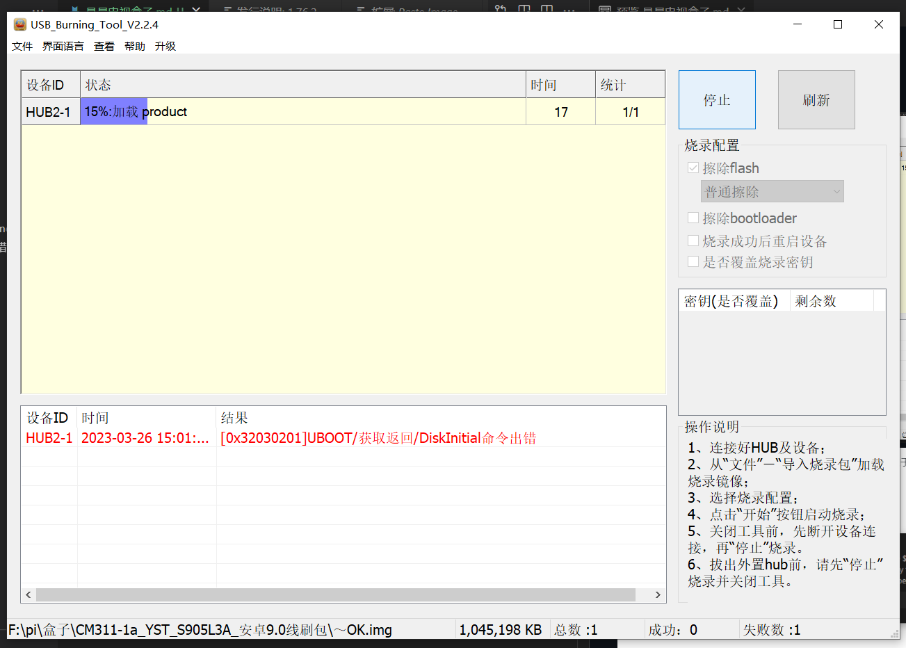
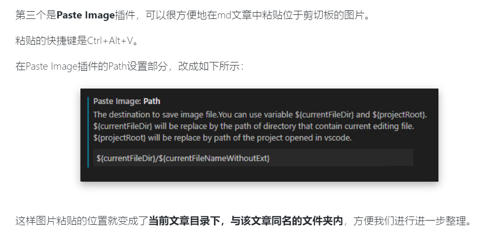
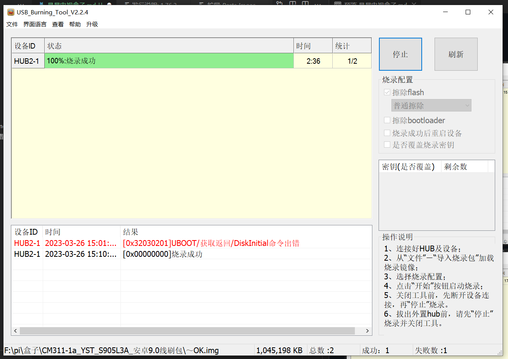
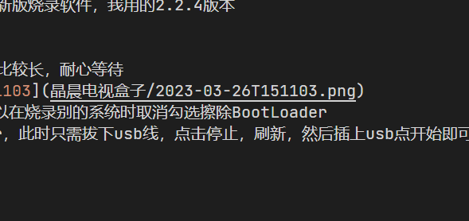
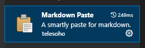

### 烧录报错，卡7%，解决办法





```

1.正常短接烧录，卡7%报错后点停止然后刷新
2.不用短接，直接点开始，进度条就会在直接7%开始
3.多试几次，推荐用新版烧录软件，我用的2.2.4版本
中间stystem段时间比较长，耐心等待
烧录好之后，以后可以在烧录别的系统时取消勾选擦除BootLoader
有时候会卡到vendor，此时只需拔下usb线，点击停止，刷新，然后插上usb点开始即可重新开始。

```

### markdown paste插件备忘


```
只需修改Markdown Paste: Path为即可
${fileBasenameNoExtension}

```