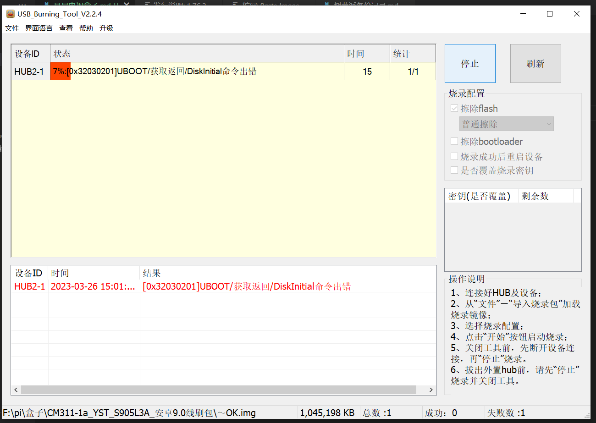
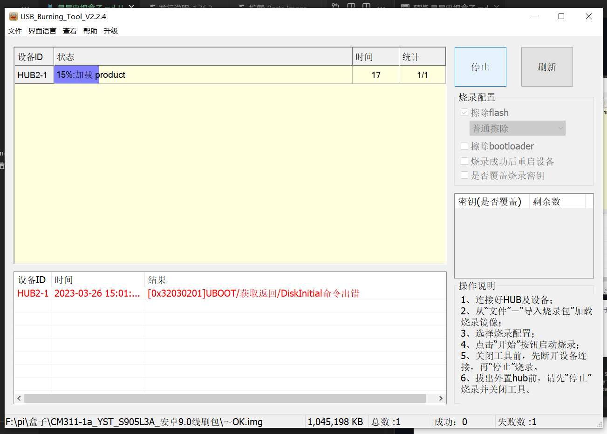
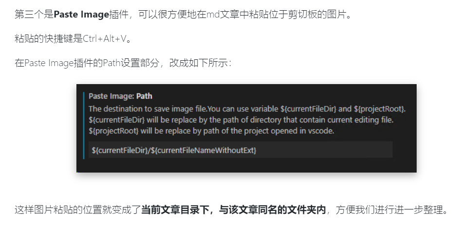
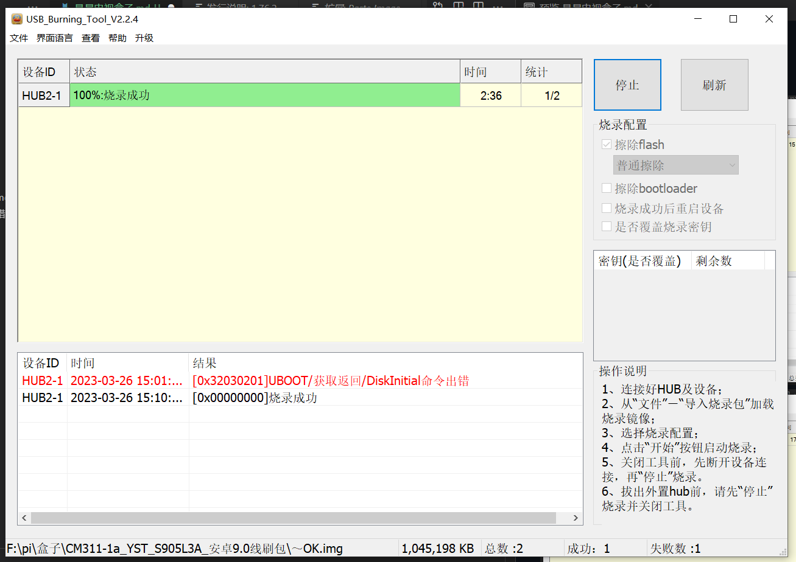
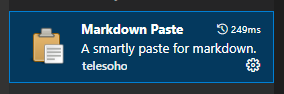
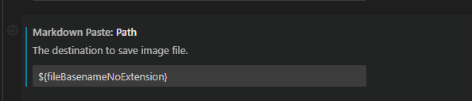
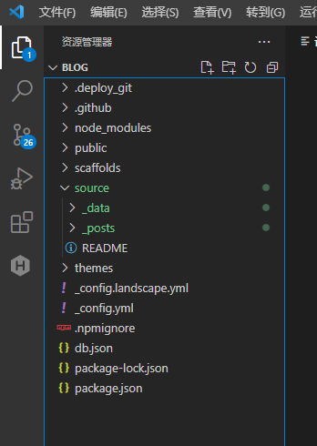

# 电视盒子记录
<!--more-->
短接点
或者
### 烧录报错，卡7%，解决办法




```

1.正常短接烧录，卡7%报错后点停止然后刷新
2.不用短接，直接点开始，进度条就会在直接7%开始
3.多试几次，推荐用新版烧录软件，我用的2.2.4版本

```
中间stystem段时间比较长，耐心等待
烧录好之后，以后可以在烧录别的系统时取消勾选擦除BootLoader
有时候会卡到vendor，此时只需拔下usb线，点击停止，刷新，然后插上usb点开始即可重新开始。
### 电视盒子修改开机画面
一般的做法是替换 Android 设备 system/media/bootanimation.zip 文件。当然也可以通过CustomizationTool 来修改固件实现。
1.首先通过 adb push 命令将文件上传到 sdcard 的根目录下。
2.然后通过 adb shell 进入 设备目录下，提取 root 权限， 把 bootanimation.zip 覆盖到 system/media 目录下。
3.修改 bootanimation.zip 文件权限为可读可写可执行（777）。
```
# adb push C:\Users\11367\Desktop\bootanimation.zip /sdcard/bootanimation.zip
# adb shell
# su
# mount -o remount,rw /system
# cp /sdcard/bootanimation.zip /system/media/bootanimation.zip
# cd /system/media/
# chmod 777 bootanimation.zip（很重要）
```
注意： 有的机器 mount -o remount,rw /system 这句命令可能不行，那就试一试 mount -o rw，remount /system 。 一定要修改更换的bootanimation.zip的权限，否则修改开机动画失败。
### 修改开机第一屏，logo界面（未成功）
```
挂载vendor，第一屏的文件位置在/vendor/logo_files/bootup.bmp
mount -o rw,remount /vendor
按照上文替换动画文件的步骤替换即可
```
### 制作bootanimation.zip
解压 bootanimation.zip 文件你会发现，里面会有一个 desc.txt 文件和若干个 part0、part1 这样的目录。
现在我们查看 desc.txt 文件
```
720 1280 20
p 1 0 part0
P 0 0 part1
// 720 动画的宽度
// 1280 动画的高度
// 20 每秒播放20帧图片 （最好不要超过30）
// p 第二行和第三行的p表示2个part（出第一行外，通常是以p开头的）
// 1 对part中静态图片循环播放的次数。例如：part0的静态图片会播放2次，part1的静态图片只有正常的一次。
// 0 播放完当前part中的动画后，暂停的帧数。 （如该是40的话，40/20=2秒，即暂停2秒）
// part0 part1 存储静态图片的目录名称
```
注意：
1.desc.txt 文件要在 Linux 环境下生成，因为有些空格不一样
2.part 目录中的图片的命名要是连续的，比如pic_001, pic_002, _pic_003 …
3.打包成bootanimation.zip文件的时候，要要用zip格式的<font color=red>存储</font>方式打包。
### 卸载系统自带APP
APP路径
```
1.\system\app  
//该目录下存放的是核心应用，也就是大家熟知的系统APP，这些系统自带的程序是不能简单的卸载的，要通过一些特殊的方式才能删除（大家熟悉的一种方法是用RE文件管理器）。
2.\system\preinstall
3.\system\priv-app
```
卸载命令
```
adb shell pm list packages
// 通过adb命令获取apk的安装路径，命令如下：
adb shell pm path +apk包名
//adb shell pm uninstall --user 0 com.nextbit.app
adb shell pm uninstall --user 0 +包名
```
### ADB单刷某一分区（以boot.img为例）
```
 //先将boot.img放到/mnt/sdcard/下面
 adb root
 adb remount
 adb push boot.img /mnt/sdcard/
 //再查找boot.img挂载在哪里
 adb shell
 cd dev/
 find -name boot
 ```

```
//然后在用dd指令将boot.img挂载在查找到路径下
dd if=/mnt/sdcard/boot.img of=/dev/block/platform/fe330000.sdhci/by-name/boot
sync
reboot

```
### 安卓系统启动流程
```
参考链接
https://blog.csdn.net/the_sunshine_of_king/article/details/78970452
```
### 安卓系统引导armbian启动流程
```

```
### markdown paste插件备忘录


```
只需修改Markdown Paste: Path为即可
${fileBasenameNoExtension}

```
### Hexo utils插件备忘录

用vscode打开以上路径文件夹即可使用，插件设置保持默认