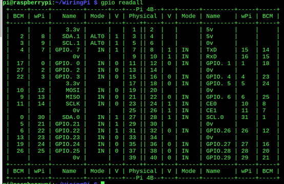
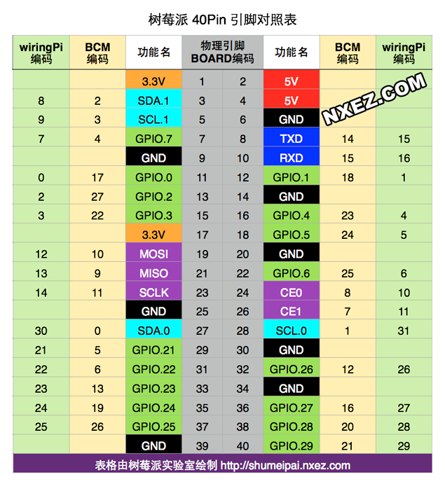

# 过程记录
<!--more-->
```
1.	下载wringpi库
32位系统执行下面的命令安装：
wget https://project-downloads.drogon.net/wiringpi-latest.deb
sudo dpkg -i wiringpi-latest.deb
64为系统需要手动编译：
sudo apt-get update
sudo apt-get install build-essential
git clone https://github.com/WiringPi/WiringPi.git
cd WiringPi
./build
2.	检查版本，执行命令 gpio -v 确保版本号 >=2.60
gpio readall 有如下输出
```

```
3.	安装git工具
sudo apt-get install wget git-core
4.	接线。
GND-------GND----------任意0V
VCC-------3.3V---------任意3.3V
SDA-------SDA1---------3号引脚
SCK-------SCK1---------5号引脚
5.	打开树莓派 iic接口
sudo raspi-config
6.	安装安装iic工具
sudo apt-get install i2c-tools
7.	查看iic 设备是否连接
sudo i2cdetect -y 1
8.	下载工程
Sudo git clone https://gitee.com/langhun1996/raspberry-pie.git
9.	进入工程目录
Cd raspberry-pie
10.	编译工程
gcc oled.c ssd1306_i2c.c -lwiringPi -o oled
nanopi编译错误/usr/lib/gcc/arm-linux-gnueabihf/5/../../../../lib/libwiringPi.so: undefined reference to `pthread_join'
/usr/lib/gcc/arm-linux-gnueabihf/5/../../../../lib/libwiringPi.so: undefined reference to `pthread_create'
/usr/lib/gcc/arm-linux-gnueabihf/5/../../../../lib/libwiringPi.so: undefined reference to `pthread_cancel'
collect2: error: ld returned 1 exit status
问题原因：
    pthread 库不是 Linux 系统默认的库，连接时需要使用静态库 libpthread.a，所以在使用pthread_create()创建线程，以及调用 pthread_atfork()函数建立fork处理程序时，需要链接该库。

问题解决：
    在编译中要加 -lpthread参数
    gcc thread.c -o thread -lpthread
11.	运行
./oled
12.	添加开机自启
nano /etc/rc.local
在exit()之前添加
	nohup (编译好oled文件的全名--带路径的) &
	没有括号

参考于https://cloud.tencent.com/developer/article/1743955
OLED源码地址https://gitee.com/langhun1996/raspberry-pie.git

```
# 树莓派gpio
