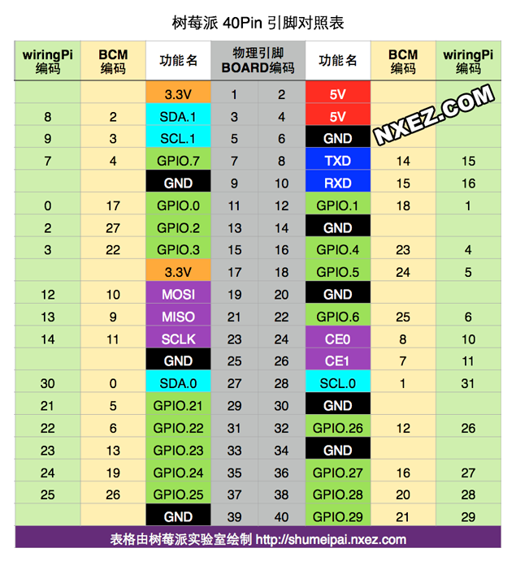

# 树莓派更换wifi
<!--more-->
```
sudo nano /etc/wpa_supplicant/wpa_supplicant.conf
sudo ifdown wlan0
sudo ifup wlan0
```
# 树莓派gpio

## 使用echo命令操作GPIO
```
使用echo命令的时候默认使用的是BCM编码
sudo echo 23 > /sys/class/gpio/export  # 把GPIO23暴露到用户空间
cd /sys/class/gpio/gpio23 # 上面那条命令会创建/sys/class/gpio/gpio23这个目录
sudo echo out > direction  # 把GPIO配置成输出模式
sudo echo 0 > value # 把GPIO拉低
sudo echo 1 > value # 把GPIO拉高

注销接口的命令：

cd ~
sudo echo 23 > /sys/class/gpio/unexport
```
## 使用gpio命令操作PIN脚
```
gpio命令默认使用的是wPi的编码方式
gpio mode 4 out # 把GPIO.23 配置为输出模式
gpio write 4 1 # 把GPIO.23 拉高
gpio write 4 0 # 把GPIO.23 拉低
gpio mode 4 in # 把GPIO.23 配置为输入模式
```
# vscode-hexo使用记录
```
Ctrl-Shift-P打开命令框
一般流程：hexo new -> hexo generate ->hexo deploy
其他命令简记：
- hexo init         # Initializes a website
- hexo new          # Creates a new article
- hexo generate     # Generates static files
- hexo publish      # Publishes a draft
- hexo server       # Starts a local server
- hexo stop         # stop a local server(Ctrl-C)
- hexo deploy       # Deploys your website
- hexo clean        # Cleans the cache file (db.json) and generated files (public)

```