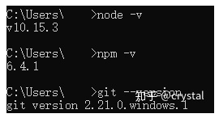
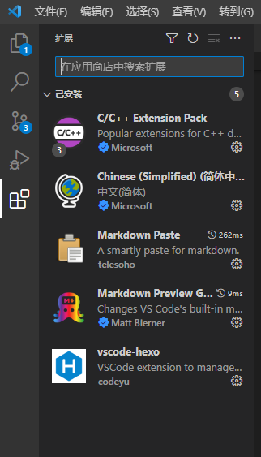

# 重装hexo博客相关
<!--more-->
## 由于重装系统后node.js没了，又想写博客又想继续使用以前的文件，特记录如下
1.安装node.js，在d盘下有以前留下的（真好）
2.安装完成后，Win+R 输入 cmd 并打开，依次输入 node -v、npm -v 和 git --version 并回车，如下图出现程序版本号即可

3.新建一个文件夹用来存放 Hexo 的文件夹，打开该文件夹，右键 -> Git Bash Here
```
//使用 npm 一键安装 Hexo 博客程序：
npm install -g hexo-cli
hexo init      # 初始化
npm install    # 安装组件
hexo g   # 生成页面
hexo s   # 启动预览
hexo clean   # 清除缓存文件等
```
4.删除新建的存放hexo的文件夹，使用我们以前的文件夹。
5.使用vscode打开_post文件夹，Ctrl、shift+P打开vscode命令面板，输入hexo，选择相应命令即可新建、部署文章。
